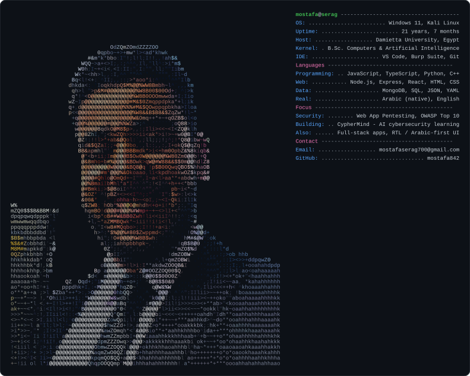

---

### 🔐 What I'm into

Computer Science graduate from **Damietta University** (Faculty of Computers & Artificial
Intelligence), focused on **web application security** — and I build the apps too, so I know
where the bodies are buried.

- 🛡️ Web app penetration testing — OWASP Top 10, Burp Suite, recon → report
- 🧠 **CypherMind** — an AI-driven cybersecurity education platform (graduation project):
  interactive vulnerability labs, a RAG AI tutor, AI exam processing, gamified classrooms
- 🌐 Full-stack work in Node.js / Express / React — including Arabic-first, RTL interfaces
- 📚 I keep a free [Web App Pentest Roadmap](https://github.com/mostafa842/WebAppPentestRoadmap)

### 🧰 Tech

### 📊 What I build in

### 📫 Reach me

<!--
Rebuild the card above with:
    python tools/gen_profile.py assets/photo-cutout.png --crop 0.50,0.19,0.87,0.52 --cols 80
See tools/README.md for the options and for how the cutout is made.
-->
